# Application Development in C#

## C/C++ vs. C# Strong type checking 

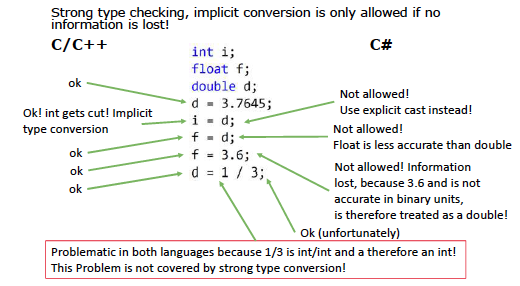

## Basic types in C# vs C/C++
- In C/C##: A double is a aligned space in memory of 8 bytes to represent a floating point number
- In C#: A double is already a struct with static methods
- Internationalization: CulturInfo!
- double d4 = double.Parse("3.54")
- f = 3.6 in C#: f = 3.7 f
- d = 1 / 3 : integer divided by integer = 0

## Arrays
    int [] test = new int[100]
    MyClass[] myTest = new MyClass[100]
    for (int i = 0; i < 100; i++){
        myTest = new myClass();
    }

## Unicode and Encoding 
    - ASCII -> 7-Bit Representation, 8-bits per char to represent a String in C
    - C# uses two bytes per char, so called Unicode
    - Unicode in UTF16, UTF8 en- /decoded

## Definitions 

## Reference types: 
    - refer to objects (Instances of classes)
    - "new"
## Value Type: 
    - based on structs
    - have normal and static methods
    - are instantiated implicity
## Structs: 
    - can not have an explicit parameter less constructor
    - they can have explicit constructors with paramters, but these must define every field
    - will not loose their paramter less constructor, if a constructor with params is defined
    - not be inherited, but all are inherited once from "Value Type"
    - can implement interfaces 
    - can be generic 

## Static: 
    - Static Fields:
      - "One per class"
      - can be accessed by static and non static methods 

    - Static Properties:
      - "One per class"
      - can be accessed by static and non static methods 
      - Mostly used for specific instance creation:
 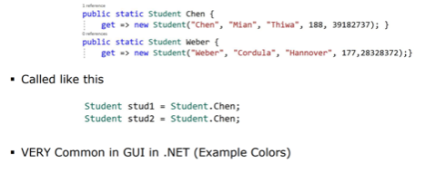

    - Staitc methods:
      - they are not associated with a certain object, but with the class itself
      - they can be called without an creating an instance of the class (an object)
      - they have no access to non-static fields (how could they?)
      - Useful Application: Generation of specific objects
  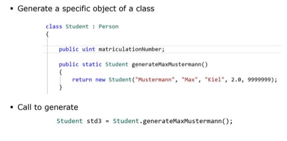

    - Static classes: 
      - Can not be instantiated 
      - Can only contain static fields or constants
      - Useful Application: Group matching functions e.g. a collection of math. functions
 
  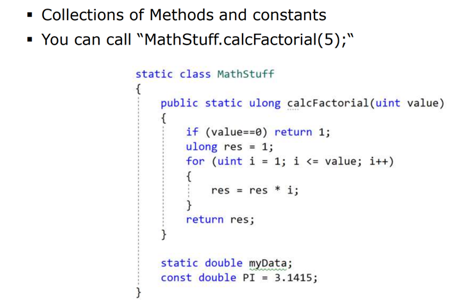

## Example of a struct 
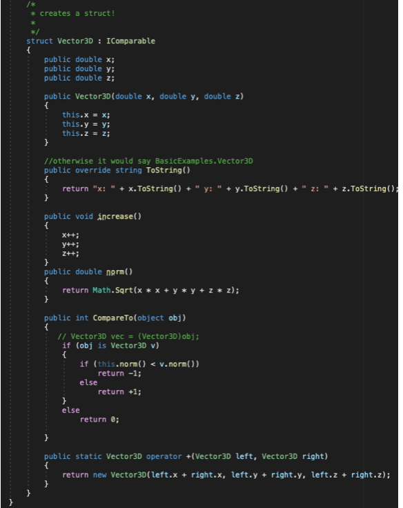

- Structs are not references: it is a Value Type 
- Vector 3D a = new Vector(1,2,3);
- Vector 3D b = a; (whole copy)
- a.10 = 1000; // a is changing, b not, but would it be a class it would change bcs than it would be a pointer there
- Array.sort uses the CompareTo from the Interface

## Enums 
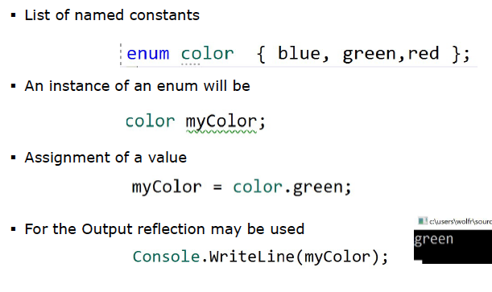

## Inline if else
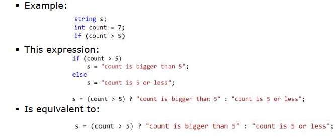

## Access
    - private: access only within the class
    - protected: within the class and all derived classes
    - public: full access

## Precision with 0.1
    - 0.1f + 0.1f+0.1f + 0.1f+0.1f + 0.1f+0.1f + 0.1f+0.1f + 0.1f = 1,000001
      - not precise enough 
    - 0,1+0,1+0,1+0,1+0,1+0,1+0,1+0,1+0,1+0,1 = 0,999999
      - not precise enough
    - 0,1 ist nicht binary-conform, ist nicht zur Basis 2
    - you can use decimal for 10 ^: 
      - 0,1m+0,1m+0,1m+0,1m+0,1m+0,1m+0,1m+0,1m+0,1m+0,1m = 1,0
    - technical stuff: double 
    - waste amount of data: flout 
## writeLine
writeLine has an overload of 17 therefore you don’t need to convert an int to a string

## Constructors
 - if a constructor (with params) is definied, the parameterless (default) constructor will stop existing, otherwise you have to define it
  
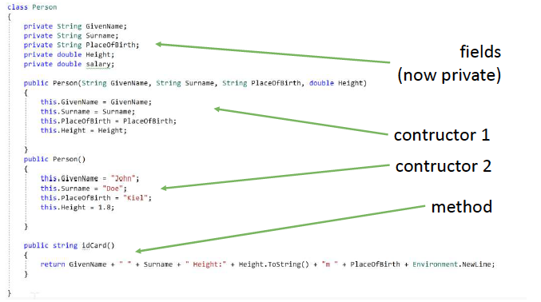
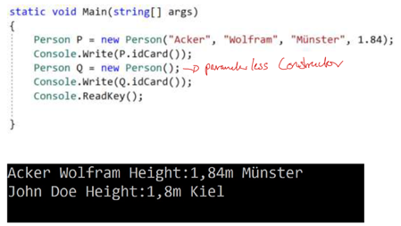

## Inheritance 
- The class is supposed to a specialized version of the other class e.g. student is still a person
- derived class can call public methods of the base class, but the field is not visible outside the object ('protected')
- access public field of the base class as if they were their own, additional fields can be defined
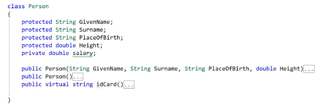
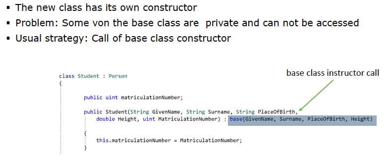

## Ploymorphism 
- Base class method: 'virtual' 
    - e.g. Person:
      -  idCard() has to be virtual
      -  toString() has to be overriden bcs it is from object-class 
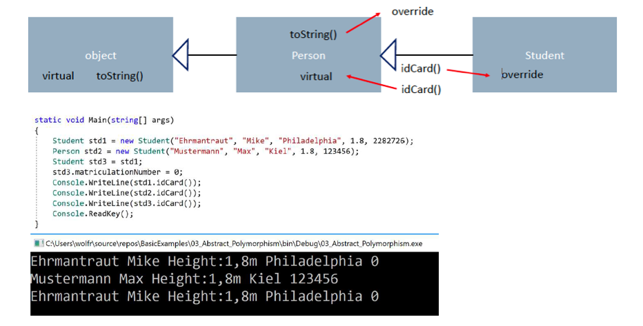

- Every Reference type in C# is derived from the class 'object', which has some predefined methods like public virtual string ToString(), public virtual bool Equals(Object obj): 
- e.g.:
    public override bool Equals(object obj)
        {
            var person = obj as Person;
            return person != null &&
                   GivenName == person.GivenName &&
                   Surname == person.Surname &&
                   PlaceOfBirth == person.PlaceOfBirth &&
                   Height == person.Height;
        }
## Abstract classes
- can not be instantiated but derived from 
- contains fields, methods with and without implementation
- all derived classes must iplement (override) of the abstract methods

## For Each
foreach (var item in people){
    Console.Writeline(item);
}

## Is-Keyword 
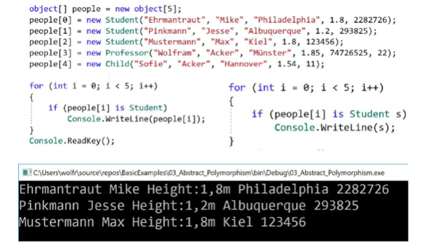

## Properties 
- Get and set methods should be used to check incoming data if
necessary
- Example: Height is not supposed to be 0 or negative
  - 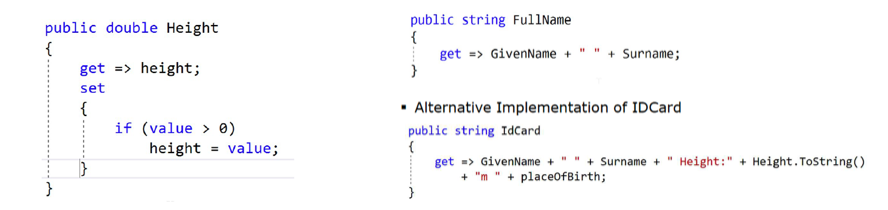
- Missing “set” realizes a read-only condition
- A write-only condition can be realized by only implementing
“set”
- Properties do not need to have a background-fields, sometime you have to create one background-field!

## Delegates 

- Have similarities with function pointers in C/C++, but they are Object-oriented, type-safe, Secure
- An instance of a delegate can hold: 
    - No method at all (Exception!)
    - One or Multiple Methods( can be added (+=) and substracted (-=), called in their order they were assigned (useful for multiple callbacks in GUI-Programs) 
    - Instances of delegates can be passed as arguments into methods()

- 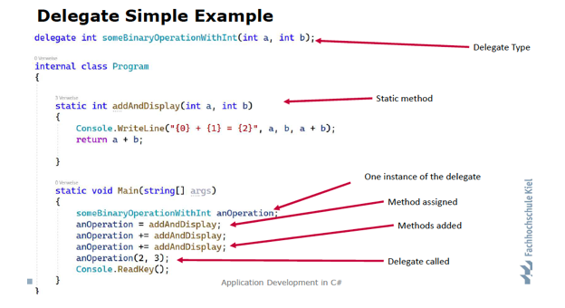

- Delegate types: 
  - 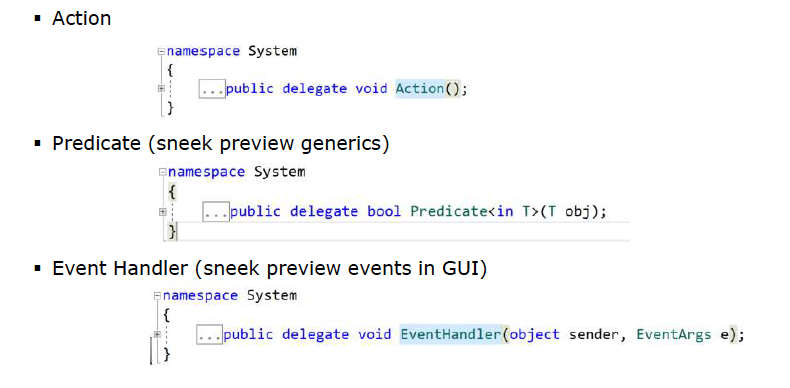
  
## Anonymous methods 
- The mechanism to inject a functionality by assigning a method using a delegate is extremely powerful
- It can look more complicated that it needs to be, because the method is defined “elsewhere”
- Anonymous methods provide an easy way of defining a method “on the fly”
- 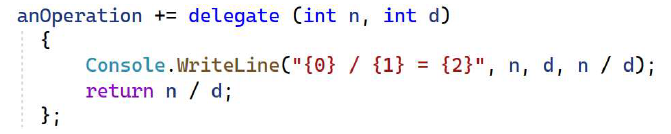
  
## Lambda Functions - Statement Lambda 
- Even simpler syntax to define a target for a delegate type 
- often used in LINQ expressions 
- 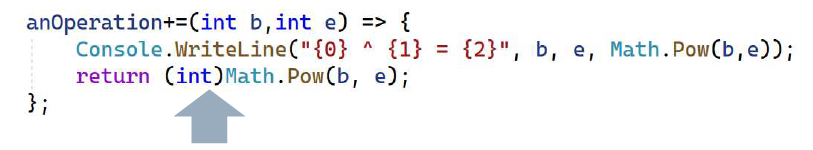
  
## Expression Lambda 
- consist of one instruction only 
- the return value of that instruction will be the return value of the lambda function 
- this example modified without the console output 
- 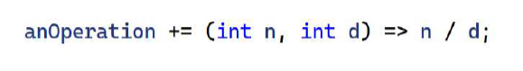
  
## Delegate Example 
- If(anOperation != null){anOperation(2,3)}; //this makes sure that anOperation has a function
- Static and non static method can be assigned to an Instance of a delegate
- 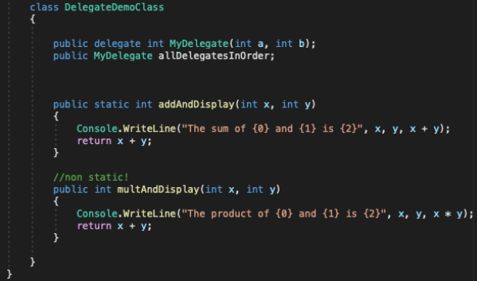
- 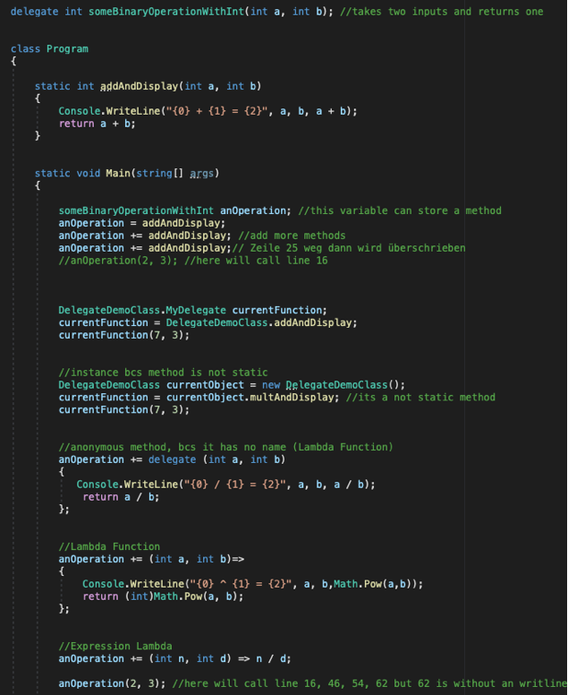
  
## Delegate Events 
- An Event can be used by an object to inform other (objects) that something happened
1. Delegates can only be invoked (raised) from WITHIN the object, object calls the method that are associated with the event
2. Methods (Event handlers) can only be added and substracted (sub. += and unsub. -=) but not assigned
3. They can be used in Interfaces
- 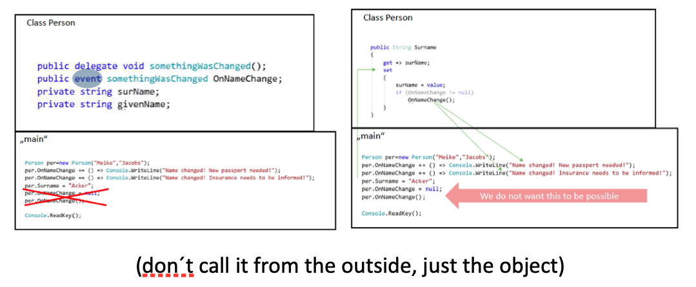
- 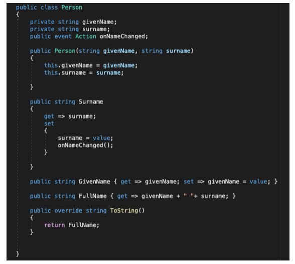
- 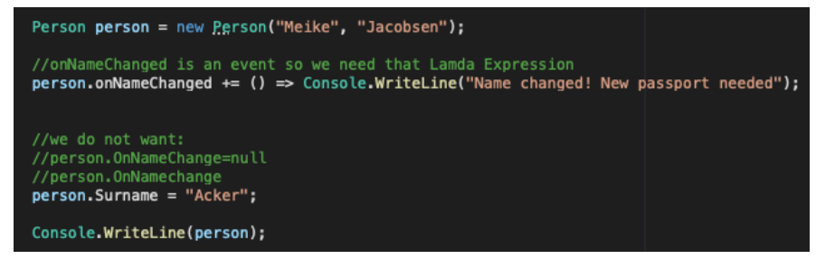

## External Hardware Timer vs. DispatcherTimer
- Timer: 
  - is using a thread and the gui has his thread: Application.Current.      Dispatcher.Invoke(()=>{
		Slider.Value++
});
 - System.Timers: no GUI sync 
 - better for calling to a server for accessing data, dispatcher time could block the messageloop bcs of its priority

- Dispatcher Timer: 
  - führt den Delegaten synchron auf dem Thread aus
  - System.DispatcherTimer: GUI sync, Priority is an additional property to be aware of
  - Dispatcher Timer:  synchronized with GUI, the call with be in the messageloop, disadavantage it´s not that predicise , has specific priority, good for events

## Interfaces 
- A class can have multiple Interfaces therefore you use it either than an abstract class 
- Not allowed to implement methods, to contain fields
- Everything is public by default
- Can have events, method-definitions
- 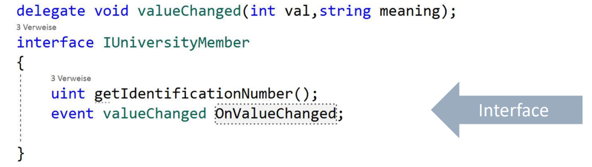
- 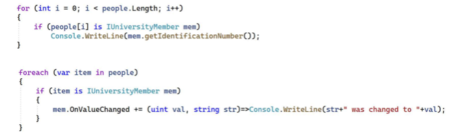
- foreach (var item in people){    
If(OnValueCHanged != null){
    
                	if(item is IUniversityMember m) //nach Interfaces fragen
                	{
                   	 m.getIdentificationNumber();
                	}
}
## Overview 
- 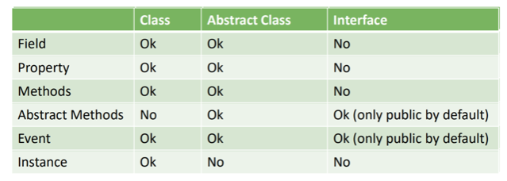

## Generics 
- 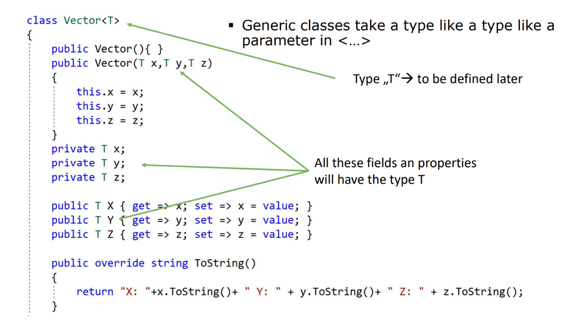
- 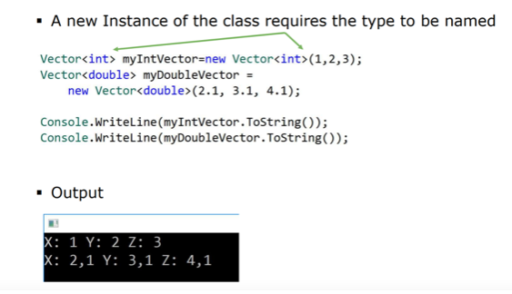

## Inheritance and Generic Classes
### Closing 
- Decrease the number of generic types:
- 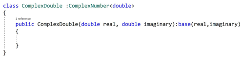

### Opening 
- Simply pass on the type to the base class:
- 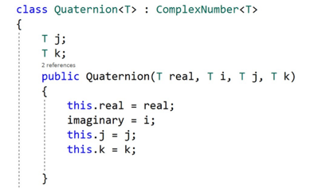
  
## Collections: List <T>
- Add: add an item to the list
- AddRange(IEnumerable<T> collection): Many items
- Contains(T item): checks if the list contain “item”
- Find(Predicate<T> match) returns the first item that the predicate returns true on

- 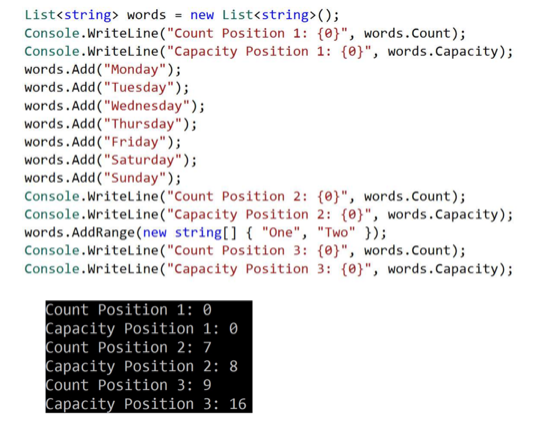
- 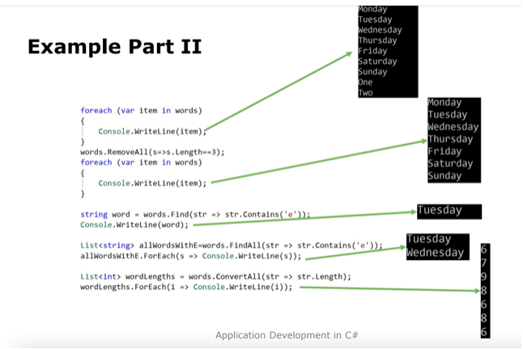
  
## Lamda Expressions/ Predicate
- words.RemoveAll(s=> s.length ==3)
- ForEach short version:
	allWordsWithE.ForEach(s=>Console.WriteLine(s))
- List of type string:
	length, contains methods are available
- Find:
	Is FindFirst()
- Convert:
	Is select

## Types of List
- Queue<T> (FIFO)
- Stack <T> (LIFO)
